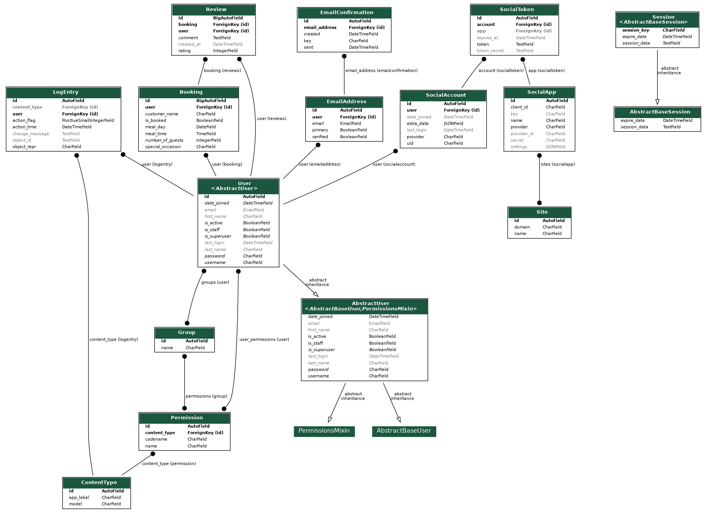

# [MICHELANGELO](https://michelangelo-e4d1cac07cf7.herokuapp.com)

[](https://github.com/conor-timmis/Michelangelo/commits/main)
[](https://github.com/conor-timmis/Michelangelo/commits/main)
[](https://github.com/conor-timmis/Michelangelo)

Welcome to Michelangelo, an authentic Italian restaurant nestled in the charming seaside town of Weston-Super-Mare.

This website is an independent homage to the restaurant, created out of admiration for their very high quality and enjoyable food. While it’s not officially affiliated with the restaurant, it’s been crafted with inspiration drawn directly from their exceptional dining experience. It aims to satisfy a restaurant's typical modern day expectation online allowing you to register, login and handle your bookings. All of this, while being able to view the restaurant in all its glory. We strive to provide a platform that not only allows users to explore and enjoy Italian cuisine, and those who appreciate good food and are always on the lookout for new culinary experiences.

Our restaurant is located on Knightstone Road, offering stunning views of the sea. Michelangelo is conveniently located at 50A Knightstone Road, Weston-Super-Mare BS23 2BE.


## UX


### Colour Scheme

My colour scheme is very basic and was chosen as I went along, to ensure readability was at a high priority throughout the development and tried to follow a ‘less is more’ approach. This approach allowed me to create a clean and uncluttered design, focusing on the essential elements and functionality of the website. I knew that if I picked a bunch of different colours it would lose a theme and overcomplicate the website, also compromising the readability and aesthetic I had going.

- `#343A40` used for primary text.
- `#202020` used for primary highlights.
- `#FFFFFF` used for secondary text.
- `#00FF00` used for secondary highlights.


I used [coolors.co](https://coolors.co/f8f9fa-343a40) to generate my colour palette.


### Typography

- [Inter](https://fonts.google.com/specimen/Inter) was used throughout the entire website with no secondary fonts.

- [Font Awesome](https://fontawesome.com) icons were used throughout the site, I used Font Awesome for my social icons and menu icons to display Vegan and Vegetarian dishes.


## User Stories


### New Site Users

- As a new site user, I would like to access the menu, so that I can make a decision with registering and booking.
- As a new site user, I would like to register to the site, so that I can make bookings.
- As a new site user, I would like to be able to login, so that I can keep track of my bookings.
- As a new site user, I would like to be able to edit my bookings, so that I can change them if I wish.
- As a new site user, I would like to delete my bookings, so that I can create one at a later date or cancel.

### Returning Site Users

- As a returning site user, I would like to view my past bookings, so that I can keep track of my visit history.
- As a returning site user, I would like to receive notifications about upcoming bookings, so that I can be prepared for my travels.
- As a returning site user, I would like to save my favorite dishes, so that I can easily book them in the future.
- As a returning site user, I would like to leave reviews for my past bookings, so that I can share my experiences with other users.
- As a returning site user, I would like to update my profile information, so that I can have my profile personalised with Michelangelo.

### Site Admin

- As a site administrator, I should be able to monitor user activity, so that I can ensure the platform is being used appropriately.
- As a site administrator, I should be able to manage the listings, so that I can maintain the quality and accuracy of the site content.
- As a site administrator, I should be able to handle user complaints and issues, so that I can maintain user satisfaction.
- As a site administrator, I should be able to update site features and content, so that I can keep the platform relevant and user-friendly.
- As a site administrator, I should be able to analyze site usage data, so that I can make informed decisions about future updates and improvements.


## Wireframes


To follow best practice, wireframes were developed for mobile, tablet, and desktop sizes.
I've used [Wireframe](https://wireframe.cc/) to design my site wireframes.

### Mobile Wireframes

<details>
<summary> Click here to see the Mobile Wireframes </summary>

Home
  - 

Menu
  - 

Login
  - 

Create Booking
  - 

View Booking
  - 


</details>

### Tablet Wireframes

<details>
<summary> Click here to see the Tablet Wireframes </summary>

Home
  - 

Menu
  - 

Login
  - 

Create Booking
  - 

View Booking
  - 

</details>

### Desktop Wireframes

<details>
<summary>Click here to see the Desktop Wireframes</summary>

Home
  - 

Menu
  - 

Login
  - 

Create Booking
  - 

View Booking
  - 

</details>


## Features


### Existing Features

<details>
<Summary>Show Existing Features</Summary>

- **Navbar**

    - The Navbar houses all the direction within the website, between the homepage, menu, login, register pages and even opted to make a button to make a button to catch the eye.


- **Carousel**

    - The carousel houses some featured images we wanted to put on display for people visiting the page, to see the view of the restaurant and a couple of the dishes, this boasts a scrolling arrow and underneath has a display of how many more images are in the carousel.


- **Reviews**

    - The review section actually posts from the view bookings page for when you want to review one of your bookings, I have made it so you can appear on the front page if you're one of the latest 3 reviews on the site.


- **Footer**

    - The footer houses the location of the restaurant and social icons for people to follow us on social media.


- **Register Form**

    - The register form is how you will create your account and identify on the website.


- **Login Form**

    - The login form will log you in with your own credentials so you can identify and interact with the website.


- **Create Booking**

    - The create booking form allows you to create your booking with certain requirements beforehand so we can know what to expect before you arrive.


- **View Bookings Page**

    - The view bookings page houses the functionality of editing and deleting your bookings, you can also make a review on a booking you have made before you have deleted the booking here to appear on the front page.


</details>


## Future Features

- **User Profile**
    - A dedicated profile page for each user where they can update their personal information, view their booking history, and manage their reviews.

- **Loyalty Program**
    - Implement a loyalty program where users can earn points for each booking or order, which can be redeemed for discounts or free items.

- **Interactive Menu**
    - An interactive menu where users can filter dishes based on dietary preferences or ingredients.


## Tools & Technologies Used


- [](https://tim.2bn.dev/markdown-builder) used to generate README and TESTING templates.
- [](https://git-scm.com) used for version control. (`git add`, `git commit`, `git push`)
- [](https://github.com) used for secure online code storage.
- [](https://gitpod.io) used as a cloud-based IDE for development.
- [](https://en.wikipedia.org/wiki/HTML) used for the main site content.
- [](https://en.wikipedia.org/wiki/CSS) used for the main site design and layout.
- [](https://www.javascript.com) used for user interaction on the site.
- [](https://jquery.com) used for user interaction on the site.
- [](https://www.python.org) used as the back-end programming language.
- [](https://www.heroku.com) used for hosting the deployed back-end site.
- [](https://getbootstrap.com) used as the front-end CSS framework for modern responsiveness and pre-built components.
- [](https://www.djangoproject.com) used as the Python framework for the site.
- [](https://www.postgresql.org) used as the relational database management.
- [](https://www.elephantsql.com) used as the Postgres database.
- [](https://whitenoise.readthedocs.io) used for serving static files with Heroku.
- [](https://wireframe.cc) used for creating wireframes.
- [](https://fontawesome.com) used for the icons.


## Database Design

```python
class Booking(models.Model):
    SPECIAL_OCCASIONS = (
        ('Bday', 'Birthday'),
        ('Anv.', 'Anniversary'),
        ('Other', 'Other'),
    )
    user = models.ForeignKey(
            settings.AUTH_USER_MODEL, on_delete=models.CASCADE, null=True
        )
    special_occasion = models.CharField(
        max_length=20, choices=SPECIAL_OCCASIONS
            )
    meal_day = models.DateField()
    meal_time = models.TimeField()
    number_of_guests = models.IntegerField()
    customer_name = models.CharField(max_length=100)
    is booked = models.BooleanField(default=False)
```



source: [medium.com](https://medium.com/@yathomasi1/1-using-django-extensions-to-visualize-the-database-diagram-in-django-application-c5fa7e710e16)


## Agile Development Process

### GitHub Projects

[GitHub Projects](https://github.com/conor-timmis/Michelangelo/projects) served as an Agile tool for this project.
It isn't a specialized tool, but with the right tags and project creation/issue assignments, it can be made to work.

Through it, user stories, issues, and milestone tasks were planned, then tracked on a weekly basis using the basic Kanban board.


### GitHub Issues

[GitHub Issues](https://github.com/conor-timmis/Michelangelo/issues) served as an another Agile tool.
There, I used my own **User Story Template** to manage user stories.

It also helped with milestone iterations on a weekly basis.


### MoSCoW Prioritization

I've decomposed my Epics into stories prior to prioritizing and implementing them.
Using this approach, I was able to apply the MoSCow prioritization and labels to my user stories within the Issues tab.

- **Must Have**: guaranteed to be delivered (*max 60% of stories*)
- **Should Have**: adds significant value, but not vital (*the rest ~20% of stories*)
- **Could Have**: has small impact if left out (*20% of stories*)
- **Won't Have**: not a priority for this iteration


## Testing

> [!NOTE]  
> For all testing, please refer to the [TESTING.md](TESTING.md) file.


## Deployment


The live deployed application can be found deployed on [Heroku](https://michelangelo-e4d1cac07cf7.herokuapp.com)


### PostgreSQL Database

This project uses a [Code Institute PostgreSQL Database](https://dbs.ci-dbs.net).

To obtain my own Postgres Database from Code Institute, I followed these steps:

- Signed-in to the CI LMS using my email address.
- An email was sent to me with my new Postgres Database.

> [!CAUTION]  
> - PostgreSQL databases by Code Institute are only available to CI Students.
> - You must acquire your own PostgreSQL database through some other method
> if you plan to clone/fork this repository.
> - Code Institute students are allowed a maximum of 8 databases.
> - Databases are subject to deletion after 18 months.

