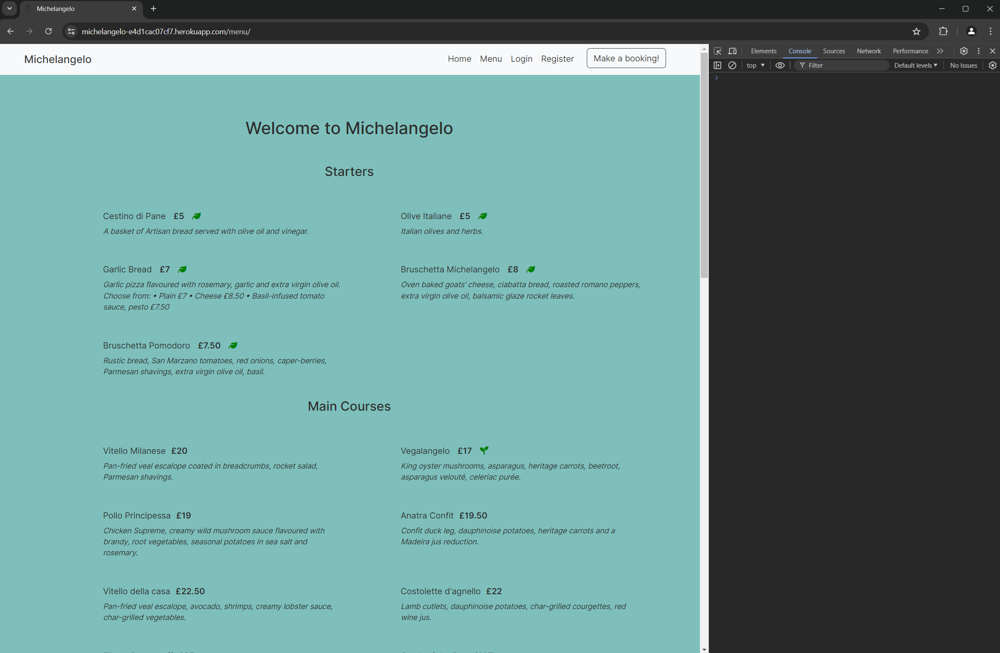
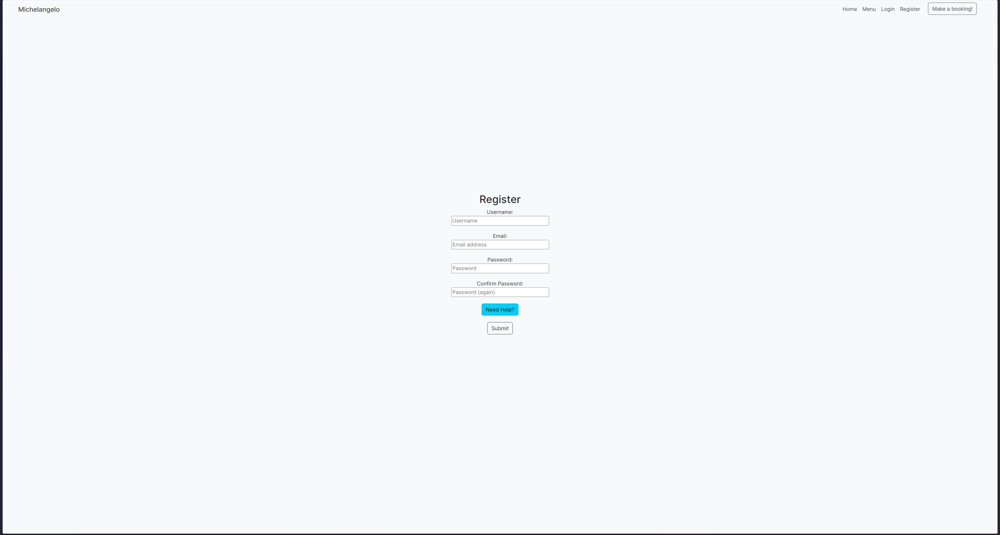
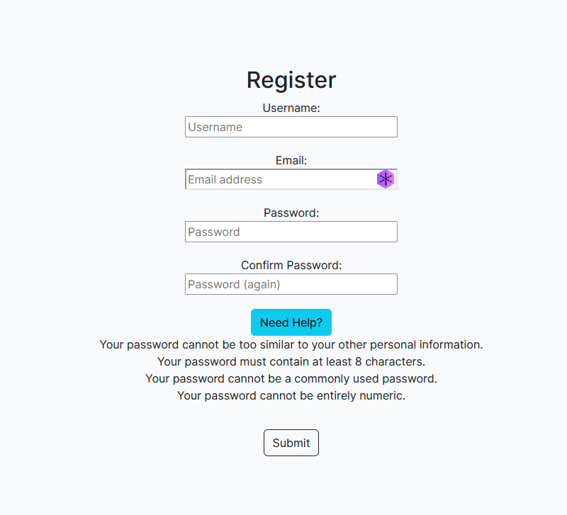
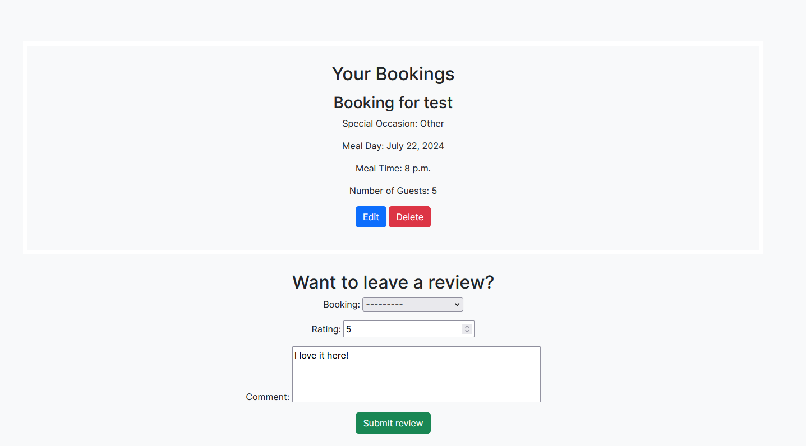
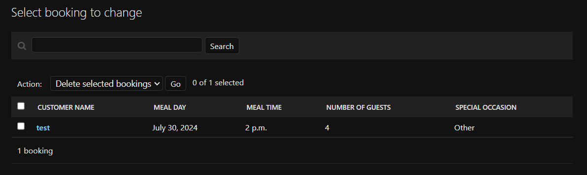

# Testing

> [!NOTE]  
> Return back to the [README.md](README.md) file.

## Code Validation

I have used the recommended [HTML W3C Validator](https://validator.w3.org) to validate all of my HTML files.

| Directory | File | Screenshot | Notes |
| --- | --- | --- | --- |
| static | base.html |  | There are errors/warnings showing but they are because of my Django tags and the validator does not like them |
| home | index.html |  | There are errors/warnings showing but they are because of my Django tags and the validator does not like them |
| menu | menu.html |  | There are errors/warnings showing but they are because of my Django tags and the validator does not like them |
| tables (create) | create_booking.html |  | There are errors/warnings showing but they are because of my Django tags and the validator does not like them |
| tables (delete) | delete_booking.html |  | There are errors/warnings showing but they are because of my Django tags and the validator does not like them |
| tables (edit) | edit_booking.html |  | There are errors/warnings showing but they are because of my Django tags and the validator does not like them |
| tables (view) | table_list.html |  | There are errors/warnings showing but they are because of my Django tags and the validator does not like them |

### CSS

I have used the recommended [CSS Jigsaw Validator](https://jigsaw.w3.org/css-validator) to validate all of my CSS files.

| Directory | File | Screenshot | Notes |
| --- | --- | --- | --- |
| static | style.css |  | Shows 1 warning of possible imported stylesheets (bootstrap for example in this case) |

### JavaScript

I have used the recommended [JShint Validator](https://jshint.com) to validate all of my JS files.

| Directory | File | Screenshot | Notes |
| --- | --- | --- | --- |
| static | signuplist.js |  | No errors or warnings found |

### Python

I have used the recommended [PEP8 CI Python Linter](https://pep8ci.herokuapp.com) to validate all of my Python files.

| Directory | File | CI URL | Screenshot | Notes |
| --- | --- | --- | --- | --- |
| booking | settings.py | [PEP8 CI](https://pep8ci.herokuapp.com/https://raw.githubusercontent.com/conor-timmis/Michelangelo/main/booking/settings.py) |  | Errors shown from lines included in the initial installation of Django |
| booking | urls.py | [PEP8 CI](https://pep8ci.herokuapp.com/https://raw.githubusercontent.com/conor-timmis/Michelangelo/main/booking/urls.py) |  | All clear, no errors found |
| home | admin.py | [PEP8 CI](https://pep8ci.herokuapp.com/https://raw.githubusercontent.com/conor-timmis/Michelangelo/main/home/admin.py) |  | All clear, no errors found |
| home | models.py | [PEP8 CI](https://pep8ci.herokuapp.com/https://raw.githubusercontent.com/conor-timmis/Michelangelo/main/home/models.py) |  | All clear, no errors found |
| home | urls.py | [PEP8 CI](https://pep8ci.herokuapp.com/https://raw.githubusercontent.com/conor-timmis/Michelangelo/main/home/urls.py) |  | All clear, no errors found |
| home | views.py | [PEP8 CI](https://pep8ci.herokuapp.com/https://raw.githubusercontent.com/conor-timmis/Michelangelo/main/home/views.py) |  | All clear, no errors found |
| main | manage.py | [PEP8 CI](https://pep8ci.herokuapp.com/https://raw.githubusercontent.com/conor-timmis/Michelangelo/main/manage.py) |  | All clear, no errors found |
| menu | admin.py | [PEP8 CI](https://pep8ci.herokuapp.com/https://raw.githubusercontent.com/conor-timmis/Michelangelo/main/menu/admin.py) |  | All clear, no errors found |
| menu | models.py | [PEP8 CI](https://pep8ci.herokuapp.com/https://raw.githubusercontent.com/conor-timmis/Michelangelo/main/menu/models.py) |  | All clear, no errors found |
| menu | urls.py | [PEP8 CI](https://pep8ci.herokuapp.com/https://raw.githubusercontent.com/conor-timmis/Michelangelo/main/menu/urls.py) |  | All clear, no errors found |
| menu | views.py | [PEP8 CI](https://pep8ci.herokuapp.com/https://raw.githubusercontent.com/conor-timmis/Michelangelo/main/menu/views.py) |  | All clear, no errors found |
| tables | admin.py | [PEP8 CI](https://pep8ci.herokuapp.com/https://raw.githubusercontent.com/conor-timmis/Michelangelo/main/tables/admin.py) |  | All clear, no errors found |
| tables | forms.py | [PEP8 CI](https://pep8ci.herokuapp.com/https://raw.githubusercontent.com/conor-timmis/Michelangelo/main/tables/forms.py) |  | All clear, no errors found |
| tables | models.py | [PEP8 CI](https://pep8ci.herokuapp.com/https://raw.githubusercontent.com/conor-timmis/Michelangelo/main/tables/models.py) |  | All clear, no errors found |
| tables | urls.py | [PEP8 CI](https://pep8ci.herokuapp.com/https://raw.githubusercontent.com/conor-timmis/Michelangelo/main/tables/urls.py) |  | All clear, no errors found |
| tables | views.py | [PEP8 CI](https://pep8ci.herokuapp.com/https://raw.githubusercontent.com/conor-timmis/Michelangelo/main/tables/views.py) |  | All clear, no errors found |

## Browser Compatibility

I've tested my deployed project on multiple browsers to check for compatibility issues.

| Browser | Home | Menu | Login | Register | Booking | View Booking | Notes |
| --- | --- | --- | --- | --- | --- | --- | --- |
| Chrome |  |  |  |  |  |  | Works as expected |
| Firefox |  |  |  |  |  |  | Works as expected (does not show even extension warnings that were showing in Arc) |
| Arc |  |  |  |  |  |  | Shows 5 warnings but after looking this up it all comes from an extension "uBlock Origin" I have installed |

## Responsiveness

I've tested my deployed project on multiple devices to check for responsiveness issues.

| Device | Home | Menu | Login | Register | View Booking | Notes |
| --- | --- | --- | --- | --- | --- | --- |
| Mobile (DevTools) |  |  |  |  |  | Works as expected |
| Tablet (DevTools) |  |  |  |  |  | Works as expected |
| Desktop |  |  |  |  |  | Works as expected |
| XL Monitor |  |  |  |  |  | Works as expected |
| 4K Monitor |  |  |  |  |  | Works as expected |

## Lighthouse Audit

I've tested my deployed project using the Lighthouse Audit tool to check for any major issues.

| Page | Mobile | Desktop | Notes |
| --- | --- | --- | --- |
| Home |  |  | Some minor warnings |
| Menu |  |  | Some minor warnings |
| Login |  |  | Some minor warnings |
| Register |  |  | Some minor warnings |
| Booking |  |  | Some minor warnings |
| View Booking |  |  | Some minor warnings |

## Defensive Programming

Defensive programming was manually tested with the below user acceptance testing:

| Page | Expectation | Test | Result | Fix | Screenshot |
| --- | --- | --- | --- | --- | --- |
| Signup | Register is expected to require all fields with password requirements | Leaving every form empty | The feature behaved as expected, and it expected me to fill in the form, once I clicked submit, the prompt to login shown up | Test concluded and passed |  |
| Login | Login is expected to do nothing when the user does not input | Tested the feature by typing nothing into the form | The feature responded by prompting me with my login | Test concluded and passed |  |
| Logged in Pages | Block logged out user from accessing authenticated pages | Try a URL for a page that is for authenticated users | When entering the booking view page, it takes the user to the login screen | Test concluded and passed |  |
| Booking | Booking is expected to post the booking in the future | Try to create a booking in the past | The feature behaved as expected, with the datepicker not allowing days in the past as well as not allowing a booking of time before current  | Test concluded and passed |  |

## User Story Testing

| User Story | Screenshot |
| --- | --- |
| As a new site user, I would like to register for an account, so that I can make a reservation. |  |
| As a new site user, I would like to log into the website, so that I can create bookings and review. |  |
| As a new site user, I would like to create bookings, so that I can visit and enjoy some tasty food. |  |
| As a returning site user, I would like to view my past bookings, so that I can keep track of my visit history. |  |
| As a returning site user, I would like to leave a review for a dish I tried, so that I can share my experience with other users. |  |
| As a new site user, I would like the option to delete or edit my bookings, so that I can create one at a later date or cancel if I wish to. |  |
| As a site administrator, I should be able to manage reservations, so that I can keep track of the restaurant’s bookings. |  |
| As a site administrator, I should be able to manage reviews, so that I can make sure the reviews are genuine and to keep the site clean. |  |
| As a site administrator, I should be able to manage users accounts, so that I can change details for them if they so wish. |  |

## Bugs

- I do not have this bug screenshot either as I forgot in the moment, a bug I faced during development was when I changed the schema of the Booking model, it entirely broke functionality of the site, initially it would allow booking, but when you go to delete and edit any of the bookings, it would not allow anything and would display a 404 because of the model change, while the booking before the scheme change was still active. 

- To fix this, I had to delete all bookings at once with the Django Admin panel and make sure the database was fully migrated with this new schema in place.

- I do not have a screenshot for this one as I forgot in the moment, a bug I faced during development was setting up the delete booking functionality, and it worked initially, till it didn't because it would 404 every time you tried to delete a booking because the ID functionality was not in place which I had to swiftly work on after.

- To fix this, I had to implement ID functionality to the page Views so it would count the booking deletion based on which booking was being deleted by ID.

- When clicking the field for picking the date within the Create Booking page, it would show both a jQuery version and a standard, very old looking one. I was trying to develop the functionality of blocking previous dates being clicked and resulted in this until it was fixed.

    

    - To fix this, I had to remove a stylesheet cdn link to jQuery I was initially using, as it was still triggering it to show through the newly written code.

### GitHub **Issues**

**Fixed Bugs**

All previously closed/fixed bugs can be tracked [here](https://github.com/conor-timmis/Michelangelo/issues?q=is%3Aissue+is%3Aclosed).

**Open Issues**

